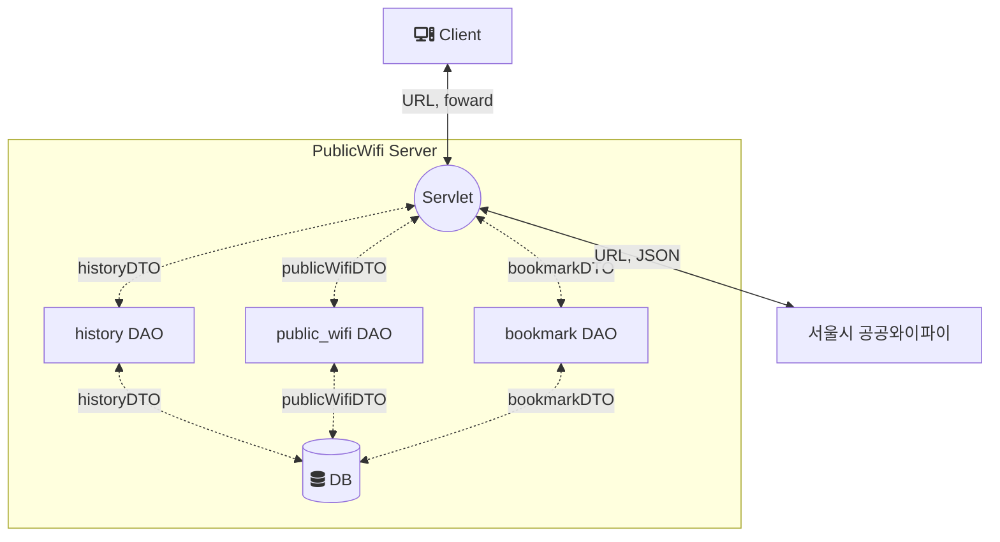

# Public Wifi Service
## :mag_right: 프로젝트의 내용과 목적
사용자 위치 기반 공공 와이파이 정보를 제공하는 웹서비스 개발<br>

본 프로젝트는 [서울시 공공와이파이 서비스 위치 정보(Open API)](https://data.seoul.go.kr/dataList/OA-20883/S/1/datasetView.do)
자원을 끌어와서 데이터를 마이그레이션 한 뒤,
사용자의 위치를 기반으로 데이터를 출력하고자 한다. <br>

본 프로젝트의 목적은 Java와 Web, DB의 개념과 이를 통한 응용을 통하여 Java, JSP, SQLite의 동작을 배우고자 한다. 뿐만 아니라 타 시스템 
호출(Open API)을 호출하는 문제 해결 능력을 키우고자 한다.<br>

## :bulb: Stacks


```
version: 
    open jdk 1.8.0_371
    sqlite 3.40.1
    tomcat 9.0.22
    jsp 2.3
    gradle 1.0-SNAPSHOT
```


## :baby: 역할
:thumbsup: 이대영
- [공공 API 불러오기](https://github.com/eod940/PublicWifi/blob/master/src/main/java/org/publicwifi/v1/servlet/wifi/GetWifiServlet.java) 기능 
- [사용자 위치 관련](https://github.com/eod940/PublicWifi/blob/master/src/main/java/org/publicwifi/v1/others/Distance.java) 기능 
- [와이파이 상세보기](https://github.com/eod940/PublicWifi/blob/master/src/main/java/org/publicwifi/v1/dao/PublicWifiDAO.java) 기능 
- [히스토리](https://github.com/eod940/PublicWifi/blob/master/src/main/java/org/publicwifi/v1/dao/HistoryDAO.java) 기능 
- [북마크](https://github.com/eod940/PublicWifi/blob/master/src/main/java/org/publicwifi/v1/dao/BookmarkDAO.java) 기능 


## :+1: 요구사항 분석
- 서울시 공공 와이파이 정보를 포함하는 테이블을 설계 후, 각 조건에 맞는 기능을 제공한다.

1. 서울시 공공와이파이 서비스 API 요청
    - Java(okhttp3, gson 라이브러리)를 이용해 [API 요청 및 결과 테스트(:line 45)](https://github.com/eod940/PublicWifi/blob/master/src/test/java/JsonTest.java) 후 진행
2. 근처 Wifi 정보 보기 기능 실행
   - 위경도 좌표 기준으로 거리 계산 (km 기준)
   - 공공와이파이 위치와 [사용자의 위치](https://github.com/eod940/PublicWifi/blob/master/src/main/webapp/WEB-INF/static/custom.js)를 이용해 가장 가까운 위치를 기준으로 사용자에게 정보 제공
3. 북마크, 히스토리 기능
   - CRUD 기능 구현
4. 와이파이 기능
   - 상세보기 기능 구현

## :ballot_box_with_check: 코드 패키지 구조
- 앱 위치 `main/.../publicwifi/v1`

```shell
.
├── main
│   ├── generated
│   ├── java
│   │   └── org
│   │       ├── example
│   │       │   └── Main.java
│   │       └── publicwifi
│   │           └── v1
│   │               ├── communication
│   │               │   └── ApiCom.java
│   │               ├── dao
│   │               │   ├── BookmarkDAO.java
│   │               │   ├── HistoryDAO.java
│   │               │   └── PublicWifiDAO.java
│   │               ├── dto
│   │               │   ├── BookmarkDTO.java
│   │               │   ├── HistoryDTO.java
│   │               │   └── PublicWifiDTO.java
│   │               ├── others
│   │               │   ├── Distance.java
│   │               │   └── Pagenation.java
│   │               ├── repository
│   │               │   └── PublicWifi.java
│   │               └── servlet
│   │                   ├── MainServlet.java
│   │                   ├── ViewServlet.java
│   │                   ├── bookmark
│   │                   │   ├── AddToBookmarkServlet.java
│   │                   │   ├── CheckDelServlet.java
│   │                   │   ├── CheckEditServlet.java
│   │                   │   ├── CreateBookmarkServlet.java
│   │                   │   ├── DeleteBookmarkServlet.java
│   │                   │   ├── EditBookmarkServlet.java
│   │                   │   ├── GroupBookmarkServlet.java
│   │                   │   ├── InsertListBookmarkServlet.java
│   │                   │   ├── ListBookmarkServlet.java
│   │                   │   ├── MakeBookmarkServlet.java
│   │                   │   ├── SubmitBookmarkServlet.java
│   │                   │   └── ViewBookmarkGroupServlet.java
│   │                   ├── history
│   │                   │   ├── CreateHistoryServlet.java
│   │                   │   ├── DeleteHistoryServlet.java
│   │                   │   └── GetHistoryServlet.java
│   │                   └── wifi
│   │                       ├── CreateWifiServlet.java
│   │                       ├── DeleteWifiServlet.java
│   │                       ├── DetailWifiServlet.java
│   │                       ├── DropWifiServlet.java
│   │                       └── GetWifiServlet.java
│   ├── resources
│   └── webapp
│       ├── WEB-INF
│       │   ├── static
│       │   │   └── custom.js
│       │   ├── views
│       │   │   ├── bookmark-add-list-submit.jsp
│       │   │   ├── bookmark-add-submit.jsp
│       │   │   ├── bookmark-del-submit.jsp
│       │   │   ├── bookmark-edit-submit.jsp
│       │   │   ├── bookmark-group-add.jsp
│       │   │   ├── bookmark-group-del.jsp
│       │   │   ├── bookmark-group-edit.jsp
│       │   │   ├── bookmark-group.jsp
│       │   │   ├── bookmark-list.jsp
│       │   │   ├── detail.jsp
│       │   │   ├── history.jsp
│       │   │   ├── load-wifi.jsp
│       │   │   └── main.jsp
│       │   └── web.xml
│       └── index.jsp
└── test
    ├── generated_tests
    ├── java
    │   ├── DBTest.java
    │   ├── DMLTest.java
    │   ├── GetTest.java
    │   ├── InsertTest.java
    │   ├── JsonTest.java
    │   └── jsonTest
    │       ├── PagenationTest.java
    │       ├── Person.java
    │       └── Wifi.java
    └── resources
```

### 앱 설계 흐름도


### ERD


- [public_wifi](https://github.com/eod940/PublicWifi/blob/master/src/main/java/org/publicwifi/v1/dao/PublicWifiDAO.java), [history](https://github.com/eod940/PublicWifi/blob/master/src/main/java/org/publicwifi/v1/dao/HistoryDAO.java), [bookmark](https://github.com/eod940/PublicWifi/blob/master/src/main/java/org/publicwifi/v1/dao/BookmarkDAO.java) 3개의 테이블

### api 가져오기


- [GetWifiServelt](https://github.com/eod940/PublicWifi/blob/master/src/main/java/org/publicwifi/v1/servlet/wifi/GetWifiServlet.java) 에서 api 호출을 위한 url 생성 후 json 값을 받아줍니다.
- 받아온 json 값은 gson library를 이용해 public_wifi 테이블에 맞게 파싱합니다.
- 받아온 값은 [PublicDTO](https://github.com/eod940/PublicWifi/blob/master/src/main/java/org/publicwifi/v1/dto/PublicWifiDTO.java)를 이용해
